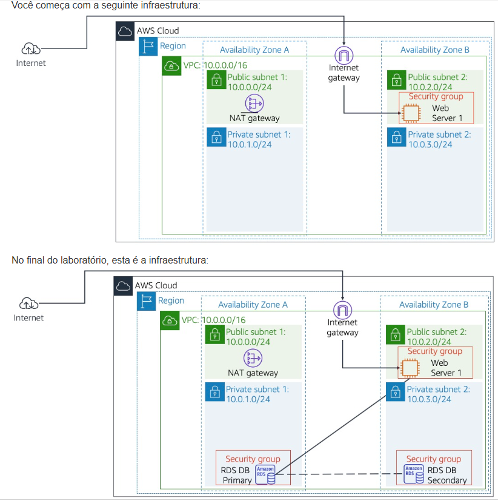

# Lab 04: Crie seu servidor de banco de dados (RDS)

Este laboratório foi projetado para reforçar o conceito de aproveitar uma instância de banco de dados gerenciada (Amazon RDS) para resolver necessidades de banco de dados relacional.

## 🏛️ Arquitetura Implementada

Este projeto adicionou uma camada de persistência de dados (um banco de dados RDS) à nossa arquitetura de VPC existente. A imagem abaixo mostra a infraestrutura final, onde o Servidor Web (na sub-rede pública) agora pode se comunicar com o Banco de Dados (nas sub-redes privadas).

---

## 🎯 Objetivo
O principal objetivo era executar uma instância de banco de dados do Amazon RDS com alta disponibilidade (Multi-AZ) e configurar a rede e a segurança para permitir que o Servidor Web (aplicativo) se conectasse e interagisse com o banco de dados.

## 🛠️ Tarefas Realizadas

Neste projeto, eu executei as seguintes tarefas:

* **1. Criação de Sub-redes Privadas:**
    * Garanti que existiam sub-redes privadas em pelo menos duas Zonas de Disponibilidade (para Alta Disponibilidade).

* **2. Criação de um DB Subnet Group:**
    * Criei um "Subnet Group" para o RDS, informando ao serviço em quais sub-redes privadas ele deveria operar.

* **3. Lançamento da Instância RDS:**
    * Lancei uma instância de banco de dados (ex: MySQL ou PostgreSQL).
    * Configurei a instância para ser **Multi-AZ (Alta Disponibilidade)**, o que cria uma réplica "Standby" em outra AZ.
    * Coloquei a instância RDS dentro das sub-redes privadas.

* **4. Configuração de Segurança (Security Groups):**
    * Criei um **Security Group para o RDS** (`RDS-SG`).
    * Configurei o `RDS-SG` para permitir tráfego de entrada na porta do banco de dados (ex: 3306 para MySQL) **apenas** a partir do Security Group do Servidor Web (`Web-SG`).
    * Editei o `Web-SG` (do Lab anterior) para garantir que ele podia fazer conexões de saída para o `RDS-SG`.

* **5. Teste de Conectividade:**
    * Acessei o aplicativo Web (que estava no Servidor Web) e o configurei para usar o "endpoint" do banco de dados RDS, comprovando a interação bem-sucedida entre o front-end e o back-end.

## 💡 Conceitos Aprendidos
-   A vantagem de usar um serviço gerenciado como o RDS (provisionamento, patching, backups).
-   A importância da **Alta Disponibilidade (Multi-AZ)** para tolerância a falhas.
-   A melhor prática de segurança de colocar bancos de dados em **sub-redes privadas**, inacessíveis diretamente pela internet.
-   Como configurar **Security Groups** para atuar como um firewall de estado, permitindo a comunicação segura entre camadas da aplicação (EC2 -> RDS).

## 📸 Minhas Provas (Screenshots)

*(Aqui vou adicionar meus próprios screenshots do console AWS, mostrando a instância RDS rodando, a configuração Multi-AZ, os Security Groups e o aplicativo web conectado ao banco.)*
