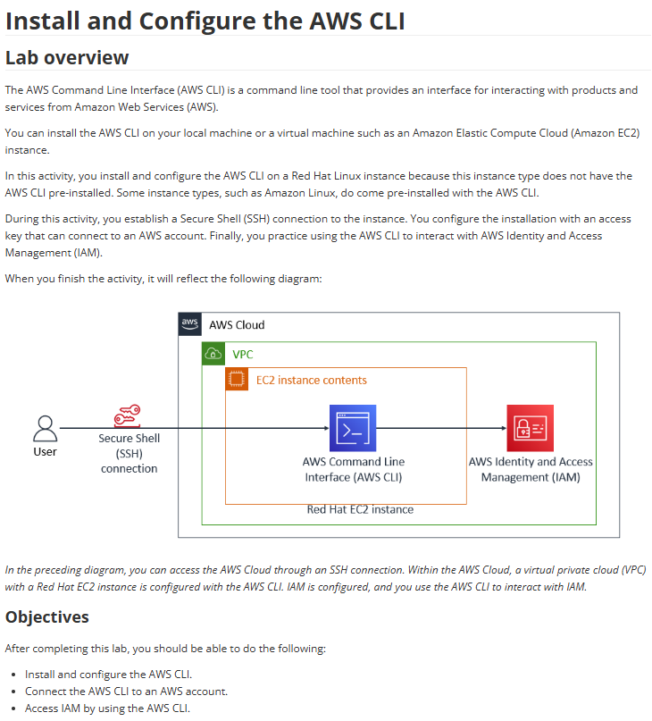

# Lab 17: Instalar e configurar a CLI da AWS

Este laboratório é focado em uma das ferramentas de gerenciamento mais poderosas da AWS: a Command Line Interface (CLI). O lab cobriu a instalação e configuração da CLI em uma instância EC2.

## 🏛️ Arquitetura Utilizada

O cenário consistiu em um usuário conectando-se via SSH a uma instância EC2 (Red Hat Linux). Como esta instância não possui a CLI pré-instalada (ao contrário do Amazon Linux), o usuário teve que instalar e configurar a CLI manualmente. Após a configuração, a CLI foi usada para interagir com o serviço AWS IAM.

---

## 🎯 Objetivo
Com base nos objetivos do lab, o foco era:
* Instalar e configurar a AWS CLI.
* Conectar a AWS CLI a uma conta AWS usando credenciais de acesso.
* Acessar e interagir com o serviço AWS IAM usando a CLI.

## 🛠️ Tarefas Realizadas

Neste projeto, eu executei as seguintes etapas:

* **1. Acesso à Instância:**
    * Conectei-me via SSH à instância EC2 Red Hat.

* **2. Instalação da AWS CLI:**
    * Como a instância não possuía a CLI, executei os comandos Linux para baixar o pacote de instalação da CLI, descompactá-lo e executar o script de instalação (`./aws/install`).

* **3. Criação de Credenciais (IAM):**
    * Acessei o console do IAM e criei um novo **Usuário IAM** (`cli-user`).
    * Selecionei **"Acesso Programático"** para este usuário, o que gerou um **ID de Chave de Acesso** (Access Key ID) e uma **Chave de Acesso Secreta** (Secret Access Key).
    * Anexei a política `IAMReadOnlyAccess` ao usuário.

* **4. Configuração da CLI:**
    * De volta ao terminal SSH, executei o comando `aws configure`.
    * Inseri o `Access Key ID` e a `Secret Access Key` do usuário IAM que criei.
    * Defini uma região padrão (ex: `us-east-1`) e um formato de saída padrão (`json`).

* **5. Teste de Acesso:**
    * Executei um comando da CLI para testar a conexão e as permissões.
    * Exemplo: `aws iam list-users`
    * O comando retornou com sucesso a lista de usuários da conta, confirmando que a CLI estava instalada e configurada corretamente.

## 💡 Conceitos Aprendidos
-   Como instalar a **AWS CLI** em uma instância Linux que não a possui por padrão.
-   A diferença entre **Acesso ao Console** e **Acesso Programático** (Chaves de Acesso) para usuários IAM.
-   O processo de configuração da CLI usando `aws configure` e como ele armazena as credenciais.
-   Como executar comandos básicos da CLI para interagir com serviços da AWS, como o IAM (`aws iam ...`).

## 📸 Minhas Provas (Screenshots)

*(Aqui vou adicionar meus próprios screenshots do terminal SSH mostrando a instalação, o comando `aws configure` e a saída bem-sucedida do comando `aws iam list-users`.)*
