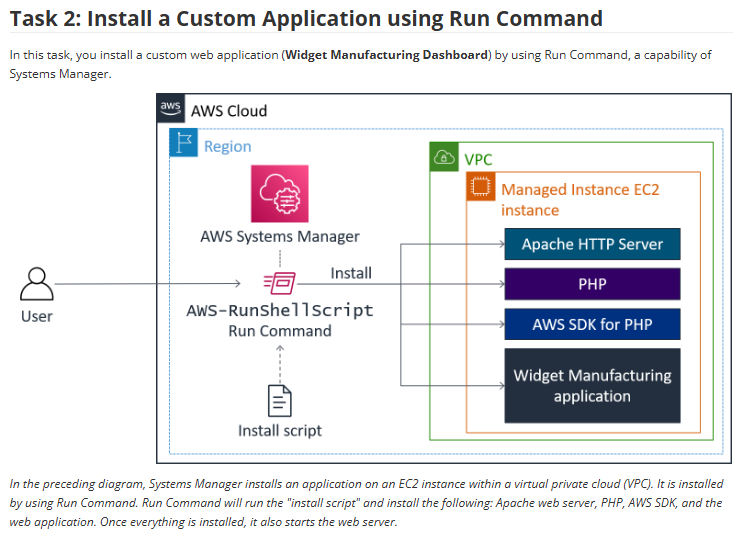
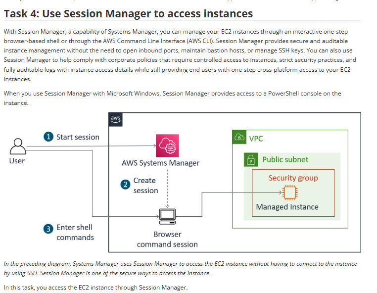

# Lab 18: Usar o AWS Systems Manager (SSM)

Este laboratório foca no AWS Systems Manager (SSM), um serviço central para operações, gerenciamento e automação de instâncias EC2 em escala. O lab explora duas das suas capacidades mais poderosas: **Run Command** e **Session Manager**.

## 🏛️ Arquiteturas Implementadas

O lab foi dividido em duas tarefas principais, cada uma com um fluxo de arquitetura diferente.

### 1. Automação com "Run Command"
Na primeira tarefa, usei o **Run Command** para executar um script remotamente e instalar uma pilha de aplicação completa (Apache, PHP, AWS SDK, etc.) em uma instância EC2, tudo isso sem uma conexão SSH.

### 2. Acesso Seguro com "Session Manager"
Na segunda tarefa, usei o **Session Manager** para obter acesso interativo (shell) à instância EC2. A conexão é feita de forma segura através do console da AWS, eliminando a necessidade de abrir a porta 22 (SSH) no Security Group.

---

## 🎯 Objetivo
Com base nos objetivos do lab, o foco era:
* Verificar configurações e permissões necessárias para o SSM.
* Executar tarefas (scripts) remotamente em servidores usando o **Run Command**.
* Acessar a linha de comando de uma instância de forma segura usando o **Session Manager**.
* Atualizar configurações de aplicações.

## 🛠️ Tarefas Realizadas

Para completar este lab, eu:

* **1. Configurei as Permissões:**
    * Garanti que a instância EC2 era uma "Managed Instance".
    * Isso envolve verificar se o **SSM Agent** está instalado (geralmente vem por padrão no Amazon Linux) e se a instância possui uma **IAM Role** com a política `AmazonSSMManagedInstanceCore`.

* **2. Executei Tarefas com "Run Command":**
    * Naveguei até o Systems Manager e selecionei o **Run Command**.
    * Escolhi o documento (document) `AWS-RunShellScript`.
    * Colei o script de instalação da aplicação "Widget Manufacturing" na caixa de comando.
    * Selecionei a instância-alvo e executei o comando, monitorando a saída (sucesso/falha) diretamente do console.

* **3. Acessei a Instância com "Session Manager":**
    * Naveguei até o **Session Manager**.
    * Selecionei a instância-alvo e iniciei uma sessão.
    * Imediatamente, um terminal (shell) completo da instância foi aberto no meu navegador, permitindo executar comandos como `ls`, `cd`, `sudo su`.
    * **Ponto chave:** Isso foi feito com o Security Group da instância **sem** nenhuma regra de entrada para a porta 22 (SSH).

## 💡 Conceitos Aprendidos
-   O SSM é a ferramenta central da AWS para gerenciamento de frotas EC2.
-   **Run Command** é para **automação** (execução "one-time" ou em massa). É ideal para instalar patches, atualizar softwares ou rodar scripts em centenas de servidores de uma vez.
-   **Session Manager** é para **acesso interativo**. É o substituto moderno e seguro para o SSH/RDP.
-   **Aumento de Segurança:** O uso do Session Manager elimina a necessidade de abrir portas de gerenciamento (22, 3389) para o mundo, reduzindo drasticamente a superfície de ataque.
-   **IAM é Chave:** Nada disso funciona sem a IAM Role correta (`AmazonSSMManagedInstanceCore`) na instância, permitindo que ela se comunique com o serviço SSM.

## 📸 Minhas Provas (Screenshots)

*(Aqui vou adicionar meus próprios screenshots mostrando a tela de sucesso do "Run Command", o terminal do "Session Manager" aberto no navegador e o Security Group da instância sem a porta 22 aberta.)*
