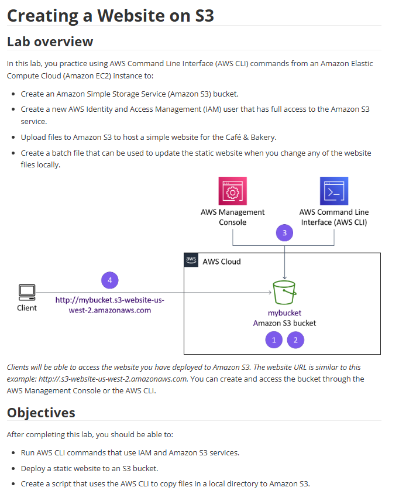

# Lab 10: Criar um site no S3 (Hospedagem de Site Estático)

Este laboratório foca em um dos casos de uso mais populares do Amazon S3: hospedar um site estático. A ênfase do lab foi realizar as operações de deploy usando a AWS Command Line Interface (CLI).

## 🏛️ Arquitetura Implementada

A arquitetura final é uma das mais simples e eficientes da AWS: um bucket S3 é configurado para servir conteúdo estático (HTML, CSS, JS) diretamente para clientes na internet através de uma URL pública. A gestão e o deploy dos arquivos foram feitos via AWS CLI.

---

## 🎯 Objetivo
Com base nos objetivos do lab, o foco era:
* Executar comandos da AWS CLI para interagir com os serviços IAM e S3.
* Implantar um site estático em um bucket S3.
* Criar um script que usa a AWS CLI para copiar/sincronizar arquivos de um diretório local para o S3, automatizando o processo de atualização.

## 🛠️ Tarefas Realizadas

Neste projeto, eu executei as seguintes etapas (primariamente via CLI a partir de uma instância EC2):

* **1. Configuração de Acesso (IAM):**
    * Criei um novo **Usuário IAM** com "Acesso Programático".
    * Anexei uma política ao usuário, concedendo permissões completas ao S3 (`AmazonS3FullAccess`).
    * Configurei a AWS CLI com as credenciais (Access Key e Secret Key) deste novo usuário.

* **2. Criação e Configuração do Bucket S3:**
    * Criei um novo bucket S3 usando o comando `aws s3 mb` (make bucket).
    * Habilitei a funcionalidade de **"Static website hosting"** no bucket.
    * Apliquei uma **Política de Bucket (Bucket Policy)** pública (em JSON) para permitir que qualquer pessoa na internet lesse (`GetObject`) os arquivos do site.

* **3. Deploy do Site via CLI:**
    * Usei o comando `aws s3 sync` para fazer o upload recursivo de todos os arquivos do site (HTML, etc.) da máquina local para o bucket S3.

* **4. Automação do Deploy:**
    * Criei um script simples (batch file) que continha o comando `aws s3 sync`. Isso permite que futuras atualizações do site sejam feitas apenas executando o script, tornando o deploy repetível e rápido.

## 💡 Conceitos Aprendidos
-   A diferença entre "Acesso ao Console" e "Acesso Programático" (IAM).
-   Como usar a **AWS CLI** para gerenciar recursos do S3 (`mb`, `sync`, `website`).
-   A importância e a sintaxe de uma **Política de Bucket** para tornar um site público.
-   Como o `aws s3 sync` é mais eficiente do que o `aws s3 cp` para atualizar sites, pois copia apenas os arquivos novos ou modificados.
-   Um conceito fundamental de **DevOps/Automação**: criar scripts para tornar os deploys consistentes e fáceis.

## 📸 Minhas Provas (Screenshots)

*(Aqui vou adicionar meus próprios screenshots mostrando o comando `aws s3 sync` sendo executado, a política do bucket no console, e o site "Café & Bakery" funcionando no navegador.)*
