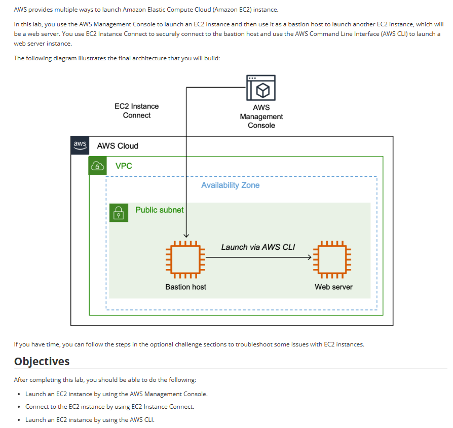

# Lab 06: Criando instâncias do Amazon EC2

Este laboratório demonstra múltiplas formas de lançar instâncias EC2, introduzindo o conceito de um Bastion Host (Servidor de Salto) e o uso da AWS Command Line Interface (CLI).

## 🏛️ Arquitetura Implementada

A arquitetura final consiste em duas instâncias EC2 em uma sub-rede pública. A primeira ("Bastion host") é lançada via console e acessada pelo EC2 Instance Connect. A segunda ("Web server") é lançada de dentro do Bastion, usando comandos da AWS CLI.

---

## 🎯 Objetivo
Com base nos objetivos do lab, o foco era aprender a:

* Lançar uma instância EC2 usando o Console de Gerenciamento da AWS.
* Conectar-se à instância EC2 usando o EC2 Instance Connect.
* Lançar uma segunda instância EC2 usando a AWS CLI (a partir da primeira instância).

## 🛠️ Tarefas Realizadas

Neste projeto, eu executei:

* **1. Lançamento do Bastion Host (via Console):**
    * Lancei a primeira instância EC2 (o "Bastion host") de forma tradicional, usando o Console AWS.
    * Configurei seu Security Group para permitir acesso.

* **2. Conexão Segura:**
    * Conectei-me ao Bastion host diretamente do navegador, de forma segura, usando o **EC2 Instance Connect**.
    * Isso eliminou a necessidade de baixar e gerenciar chaves SSH (`.pem`).

* **3. Lançamento do Web Server (via CLI):**
    * Uma vez dentro do Bastion host, usei a **AWS CLI**.
    * Executei o comando `aws ec2 run-instances` para provisionar programaticamente a segunda instância EC2 (o "Web server").

## 💡 Conceitos Aprendidos
-   A diferença fundamental entre provisionar recursos pela **Interface Gráfica (Console)** e pela **Linha de Comando (CLI)**.
-   O que é um **Bastion Host** (Servidor de Salto) e seu papel como um ponto de entrada seguro para gerenciar outros recursos na VPC.
-   Como usar o **EC2 Instance Connect** para um acesso rápido, seguro e baseado no IAM, sem a complexidade de chaves SSH.
-   O poder da AWS CLI para automação de tarefas.

## 📸 Minhas Provas (Screenshots)

*(Aqui vou adicionar meus próprios screenshots do console AWS, mostrando as duas instâncias rodando e o terminal do EC2 Instance Connect com o comando da CLI.)*
