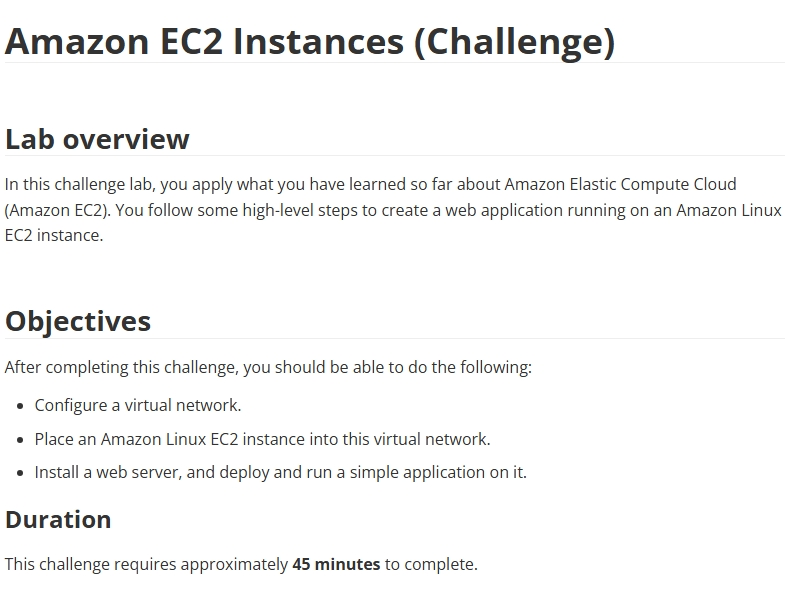

# Lab 07: [Desafio] Exercício de instância do EC2

Este foi um "Challenge Lab" (Laboratório de Desafio). Diferente dos labs guiados, o objetivo aqui era aplicar o conhecimento adquirido para construir uma solução funcional com base em um conjunto de requisitos, sem um passo-a-passo detalhado.

## 🎯 O Desafio Proposto

Os objetivos eram claros:
1.  **Configurar uma rede virtual:** Criar uma VPC.
2.  **Lançar uma instância:** Colocar uma instância EC2 Amazon Linux dentro desta rede.
3.  **Implantar uma aplicação:** Instalar um servidor web e rodar uma aplicação simples.

---

## 🛠️ A Solução que eu Implementei

Para completar o desafio, eu construí a seguinte arquitetura do zero:

* **1. Rede Virtual (VPC):**
    * Criei uma **VPC** customizada.
    * Criei uma **Sub-rede Pública**.
    * Criei e anexei um **Internet Gateway (IGW)** à VPC.
    * Configurei uma **Route Table** para a sub-rede pública, adicionando uma rota `0.0.0.0/0` para o IGW, garantindo assim o acesso à internet.

* **2. Instância EC2 (Servidor Web):**
    * Lancei uma instância EC2 (Amazon Linux) dentro da Sub-rede Pública.
    * Configurei a instância para receber um IP público automaticamente.
    * Usei um script **User Data** para instalar o servidor web Apache (`httpd`) e criar uma página `index.html` de teste.

* **3. Segurança:**
    * Criei um **Security Group** para a instância EC2.
    * Adicionei regras "inbound" (de entrada) para permitir tráfego **HTTP (porta 80)** e **SSH (porta 22)**, para que o site pudesse ser acessado e a instância gerenciada.

## 💡 Conceitos Validados
-   Este desafio validou minha capacidade de construir a fundação de uma aplicação web na AWS.
-   Reforçou a interdependência entre os serviços:
    -   EC2 não funciona sem uma **VPC**.
    -   Acesso à internet não é possível sem **IGW** e **Route Tables**.
    -   Acesso ao servidor não é possível sem **Security Groups**.
-   Demonstrou a capacidade de usar o **User Data** para automatizar a configuração do servidor no lançamento.

## 📸 Minhas Provas (Screenshots)

*(Aqui vou adicionar meus próprios screenshots do console AWS, mostrando a VPC, a instância rodando, a configuração do Security Group e, o mais importante, o navegador acessando a página web do servidor.)*
