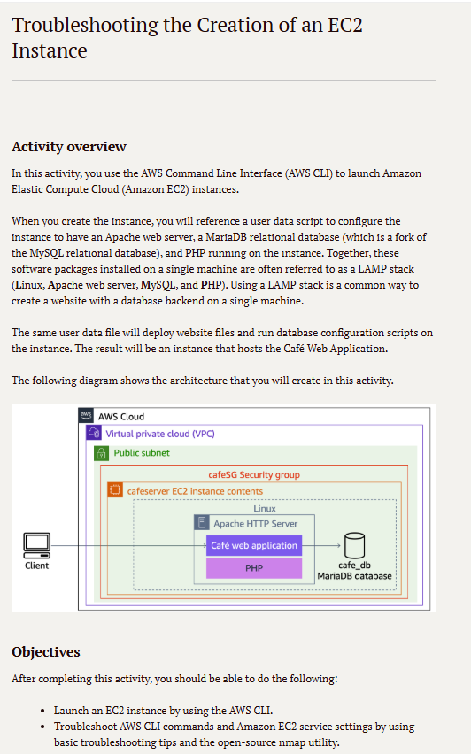

# Lab 08: Solucionar problemas para criar uma instância

Este laboratório foi focado em uma das habilidades mais críticas em Cloud: o *troubleshooting* (solução de problemas). O cenário envolvia o lançamento de uma pilha LAMP (Linux, Apache, MariaDB, PHP) em uma única instância EC2 usando a AWS CLI.

## 🏛️ Arquitetura Alvo

O objetivo era lançar uma instância EC2 que, através de um script de User Data, se autoconfigurasse com o "Café web application", incluindo o servidor web, o PHP e um banco de dados MariaDB local.

---

## 🎯 Objetivo
Os objetivos do lab eram claros:
1.  Tentar lançar uma instância EC2 usando a AWS CLI.
2.  Diagnosticar e solucionar problemas nos comandos da AWS CLI e nas configurações dos serviços EC2 (como Security Groups) que impediam a aplicação de funcionar.
3.  Usar ferramentas de troubleshooting, como o `nmap`, para verificar a conectividade.

## 🛠️ Processo de Troubleshooting (Tarefas Realizadas)

O laboratório foi desenhado para falhar inicialmente, forçando um processo de investigação:

* **1. Tentativa de Lançamento (via CLI):**
    * Executei o comando `aws ec2 run-instances` com um script de `user data` complexo para instalar a pilha LAMP.

* **2. O Problema:**
    * Após o lançamento, a aplicação "Café" não estava acessível pelo navegador.

* **3. Diagnóstico e Solução:**
    * **Verificação de Security Group:** O problema mais provável. Usei a CLI (`aws ec2 describe-security-groups`) e o console para verificar. A instância foi lançada com o SG padrão, que não permitia tráfego na **porta 80 (HTTP)**.
    * **Correção:** Criei um novo Security Group (`cafeSG`) permitindo tráfego HTTP na porta 80 e o associei à instância.
    * **Verificação de Portas:** Usei o utilitário `nmap` para confirmar que a porta 80 estava agora aberta e "ouvindo".
    * **Verificação de Logs:** (Uma etapa comum de troubleshooting) Verifiquei os logs do `user data` (em `/var/log/cloud-init-output.log`) para garantir que a instalação do Apache, PHP e MariaDB tinha sido concluída sem erros.

## 💡 Conceitos Aprendidos
-   Uma metodologia de troubleshooting de EC2:
    1.  Verificar **Security Groups** (porta 80/443 aberta?).
    2.  Verificar **Route Tables** (a sub-rede pública tem rota para o Internet Gateway?).
    3.  Verificar **Logs do User Data** (a aplicação instalou corretamente?).
-   Como usar a **AWS CLI** não só para criar (`run-instances`), but também para investigar (`describe-instances`, `describe-security-groups`).
-   O uso prático do `nmap` para validar se um firewall (Security Group) está permitindo tráfego para uma porta específica.
-   O conceito de pilha **LAMP**, uma base comum para muitas aplicações web.

## 📸 Minhas Provas (Screenshots)

*(Aqui vou adicionar meus próprios screenshots mostrando o comando `nmap` antes e depois, a configuração do Security Group corrigida e o site "Café" funcionando no navegador.)*
