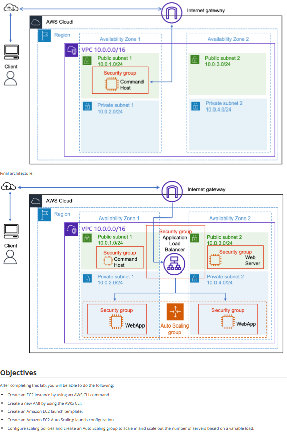

# Lab 20: Usar o Auto Scaling na AWS (via CLI)

Este laboratório avançado implementa uma arquitetura de alta disponibilidade e escalabilidade (ELB + ASG), com foco principal na execução das tarefas usando a **AWS Command Line Interface (CLI)**.

## 🏛️ Arquitetura Implementada

A arquitetura final é um padrão de mercado:
* Um **"Command Host"** (Bastion) na Sub-rede Pública é usado para executar os comandos da CLI.
* Um **Application Load Balancer (ALB)** é provisionado nas Sub-redes Públicas para receber o tráfego.
* Um **Auto Scaling Group (ASG)** lança instâncias "WebApp" nas **Sub-redes Privadas** em múltiplas Zonas de Disponibilidade.

---

## 🎯 Objetivo
Com base nos objetivos do lab, o foco era executar as seguintes tarefas **primariamente via AWS CLI**:
* Criar uma instância EC2 (o "Command Host") via CLI.
* Criar uma **Amazon Machine Image (AMI)** ("Golden Image") a partir de um servidor web, via CLI.
* Criar um **Launch Template** (Modelo de Lançamento) e/ou **Launch Configuration** (Configuração de Lançamento).
* Criar um **Auto Scaling Group (ASG)**.
* Configurar **Políticas de Scaling** (escalabilidade) para adicionar e remover servidores com base na carga.

## 🛠️ Tarefas Realizadas (Foco na CLI)

Todo o provisionamento foi feito a partir do "Command Host" usando a AWS CLI:

* **1. Criação da "Golden Image" (AMI):**
    * Executei o comando `aws ec2 create-image` a partir de uma instância "WebApp" de modelo, para criar a AMI que serviria de base para o auto-scaling.

* **2. Criação do Modelo de Lançamento:**
    * Executei `aws ec2 create-launch-template`, especificando a AMI criada, o tipo de instância, os Security Groups e outros parâmetros de lançamento.

* **3. Criação do Load Balancer (ALB):**
    * Usei comandos como `aws elbv2 create-load-balancer` e `aws elbv2 create-target-group` para provisionar o ALB e o Target Group nas sub-redes públicas.

* **4. Criação do Auto Scaling Group (ASG):**
    * Executei o comando `aws autoscaling create-auto-scaling-group`.
    * Neste comando, especifiquei o **Launch Template**, as **Zonas de Disponibilidade** (as sub-redes privadas), o **Target Group** do ALB, e o tamanho desejado/mín/máx do grupo.

* **5. Configuração das Políticas de Scaling:**
    * Usei `aws autoscaling put-scaling-policy` para criar as políticas (ex: "scale-out se CPU > 70%").
    * Criei os **Alarmes do CloudWatch** (`aws cloudwatch put-metric-alarm`) e os vinculei às políticas para automatizar o processo.

## 💡 Conceitos Aprendidos
-   **Infraestrutura como Código (IaC):** O uso da CLI é um passo fundamental para a automação. Tudo o que foi feito via CLI pode ser colocado em um script.
-   **Automação do Ciclo de Vida do ASG:** Como criar AMIs, Launch Templates e os próprios Auto Scaling Groups de forma programática.
-   **Sintaxe da AWS CLI:** Este lab foi um mergulho profundo nos comandos complexos e multi-parâmetros da CLI para `ec2`, `elbv2` e `autoscaling`.
-   A importância do **"Command Host"** como um servidor de gerenciamento seguro (Bastion) de onde os scripts de automação são executados.

## 📸 Minhas Provas (Screenshots)

*(Aqui vou adicionar meus próprios screenshots do terminal do "Command Host" mostrando os comandos da AWS CLI sendo executados e a saída JSON de sucesso.)*
