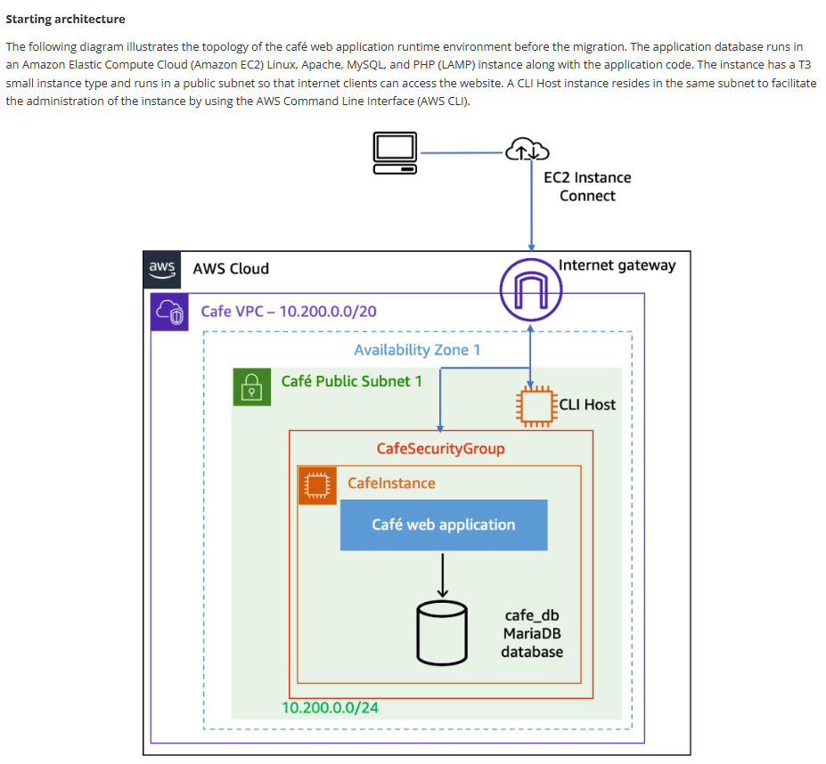
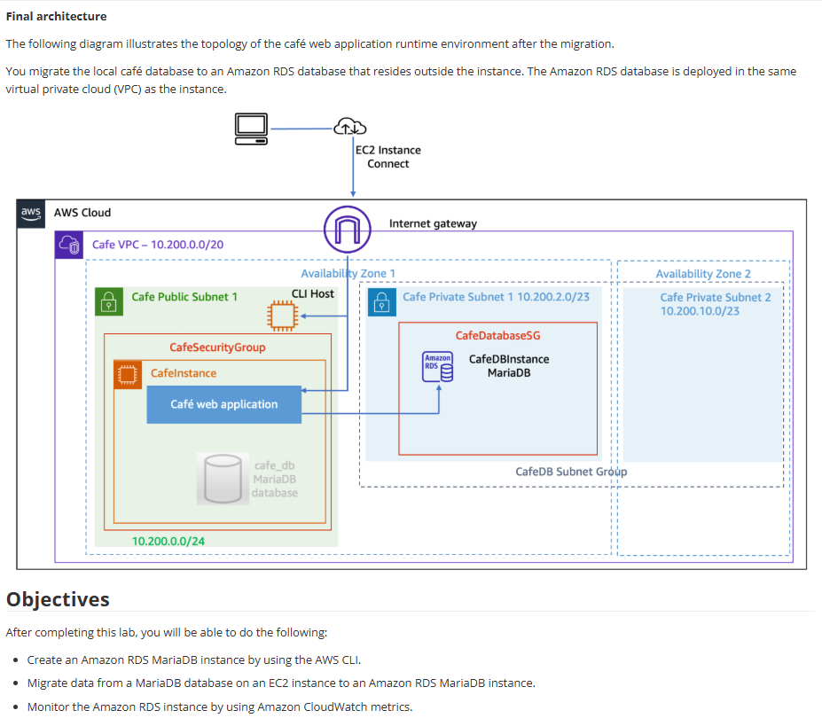

# Lab 05: Migrar para o Amazon RDS

Este foi um laboratório complexo e muito prático, simulando um cenário do mundo real: migrar um banco de dados que estava rodando "on-premise" (neste caso, na própria instância EC2) para um serviço gerenciado (Amazon RDS).

## 🏛️ Arquitetura: Antes e Depois da Migração

A mudança na arquitetura demonstra claramente os benefícios de segurança e gerenciamento do RDS.

### Arquitetura Inicial (Antes)
O aplicativo web e o banco de dados MariaDB rodavam juntos na mesma instância EC2, na sub-rede pública. Isso não é uma boa prática de segurança ou escalabilidade.

### Arquitetura Final (Depois da Migração)
Migramos o banco de dados para uma instância Amazon RDS Multi-AZ em uma sub-rede privada. O aplicativo web foi reconfigurado para apontar para o novo endpoint do RDS, e os Security Groups foram ajustados para permitir a comunicação segura.

---

## 🎯 Objetivo
O objetivo era migrar um banco de dados MariaDB de uma instância EC2 para uma instância Amazon RDS, tudo isso usando a AWS CLI (Command Line Interface).

## 🛠️ Tarefas Realizadas

Com base nos objetivos do laboratório, eu executei:

* **1. Criação de Recursos (via AWS CLI):**
    * Provisionei a instância de banco de dados Amazon RDS MariaDB usando comandos da CLI.
    * Configurei um DB Subnet Group para alocar o RDS nas sub-redes privadas corretas.
    * Criei um Security Group específico para o RDS (`CafeDatabaseSG`).

* **2. Migração dos Dados:**
    * Realizei a migração (dump) do banco de dados que estava na instância EC2.
    * Restaurei (restore) esse dump na nova instância RDS.
    * Reconfigurei o aplicativo web (Café) para parar de usar o banco local (`localhost`) e apontar para o novo "endpoint" do RDS.

* **3. Monitoramento:**
    * Verifiquei o Amazon CloudWatch para monitorar a performance e o status da nova instância RDS após a migração.

## 💡 Conceitos Aprendidos
-   Os benefícios de **desacoplar** o banco de dados da camada de aplicação.
-   A importância de rodar bancos de dados em **sub-redes privadas** por segurança.
-   Como usar a **AWS CLI** para provisionar e gerenciar recursos, indo além do console.
-   O processo básico de migração "lift-and-shift" de um banco de dados.
-   Monitoramento de performance de banco de dados com CloudWatch.

## 📸 Minhas Provas (Screenshots)

*(Aqui vou adicionar meus próprios screenshots do console AWS, mostrando a instância RDS rodando, os logs da migração e a aplicação web funcionando com o novo banco.)*
