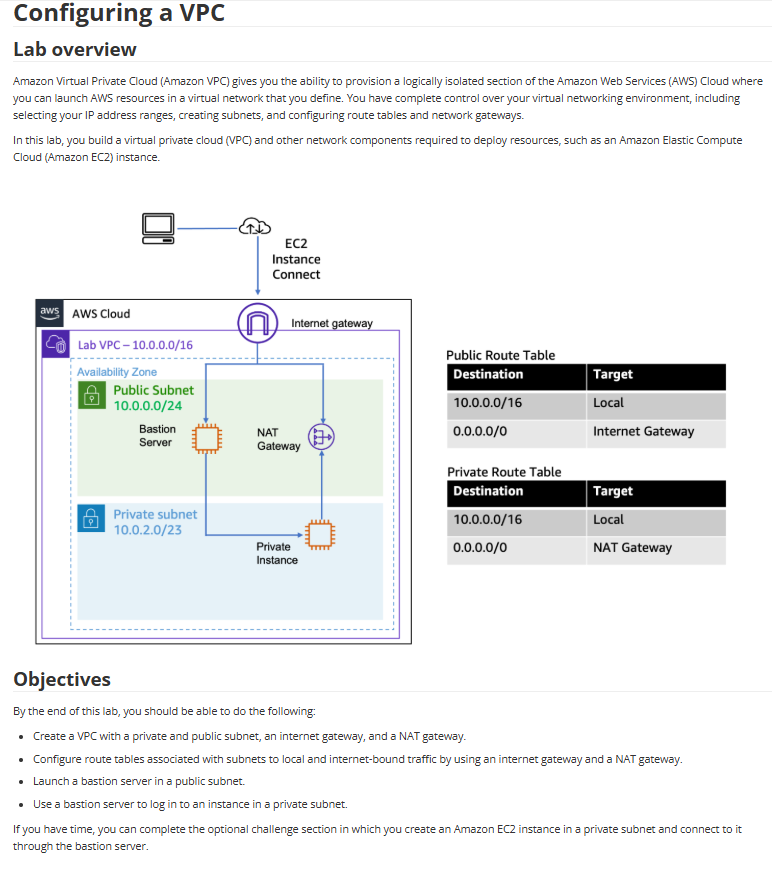

# Lab 15: Configurar uma Amazon VPC

Este laboratório é focado na construção da fundação de toda a AWS: uma Virtual Private Cloud (VPC) customizada e segura. A arquitetura implementada é um padrão de mercado, com sub-redes públicas e privadas para isolar recursos.

## 🏛️ Arquitetura Implementada

A arquitetura final consiste em uma VPC com duas sub-redes (pública e privada).
* A **Sub-rede Pública** contém um **Bastion Server** (para acesso) e um **NAT Gateway** (para saída de internet).
* A **Sub-rede Privada** contém uma **Instância Privada** que só pode ser acessada pelo Bastion e só pode acessar a internet através do NAT.

---

## 🎯 Objetivo
Com base nos objetivos do lab, o foco era:
* Criar uma VPC com uma sub-rede pública, uma sub-rede privada, um Internet Gateway (IGW) e um NAT Gateway.
* Configurar as **Tabelas de Rotas** (Route Tables) para direcionar o tráfego corretamente.
* Lançar um "Bastion server" (Servidor de Salto) na sub-rede pública.
* Usar o Bastion para conseguir acessar (via SSH) uma instância na sub-rede privada.

## 🛠️ Tarefas Realizadas

Para construir esta infraestrutura de rede, eu:

* **1. Criei a VPC e Sub-redes:**
    * Provisionei a VPC (`10.0.0.0/16`).
    * Criei a **Sub-rede Pública** (`10.0.0.0/24`).
    * Criei a **Sub-rede Privada** (`10.0.2.0/23`).

* **2. Configurei os Gateways:**
    * Criei e anexei um **Internet Gateway (IGW)** à VPC.
    * Criei um Elastic IP e o usei para provisionar um **NAT Gateway** (Gateway NAT), posicionando-o dentro da **Sub-rede Pública**.

* **3. Configurei as Tabelas de Rotas (O Cérebro da Rede):**
    * Criei uma **Tabela de Rota Pública** e a associei à sub-rede pública. Adicionei a rota `0.0.0.0/0` com destino ao **Internet Gateway (IGW)**.
    * Criei uma **Tabela de Rota Privada** e a associei à sub-rede privada. Adicionei a rota `0.0.0.0/0` com destino ao **NAT Gateway**.

* **4. Lancei e Testei as Instâncias:**
    * Lancei a instância **"Bastion Server"** na **Sub-rede Pública**, com um IP público.
    * Lancei a instância **"Private Instance"** na **Sub-rede Privada**, *sem* um IP público.
    * Ajustei os Security Groups para permitir SSH para o Bastion (a partir do meu IP) e SSH para a Instância Privada (a partir do Bastion).
    * Conectei-me ao Bastion (via EC2 Instance Connect ou SSH).
    * De dentro do Bastion, conectei-me (via SSH) à Instância Privada usando seu IP privado.
    * Executei `ping google.com` na instância privada para confirmar que ela tinha acesso de *saída* à internet através do NAT Gateway.

## 💡 Conceitos Aprendidos
-   **Sub-rede Pública vs. Privada:** A diferença é a Tabela de Rotas. Uma sub-rede pública tem uma rota para o IGW; uma privada não tem.
-   **Internet Gateway (IGW):** Permite comunicação de *entrada e saída* (bi-direcional) com a internet.
-   **NAT Gateway:** Permite comunicação de *saída apenas* (unidirecional) para a internet. É usado para que instâncias privadas possam baixar atualizações sem serem expostas.
-   **Bastion Host (Servidor de Salto):** É a única porta de entrada segura (em uma sub-rede pública) para gerenciar instâncias em sub-redes privadas.
-   A importância de **Route Tables** para controlar o fluxo de tráfego (roteamento) dentro da VPC.

## 📸 Minhas Provas (Screenshots)

*(Aqui vou adicionar meus próprios screenshots mostrando a conexão SSH para o Bastion, o SSH do Bastion para a instância privada, e o comando `ping` funcionando na instância privada.)*
