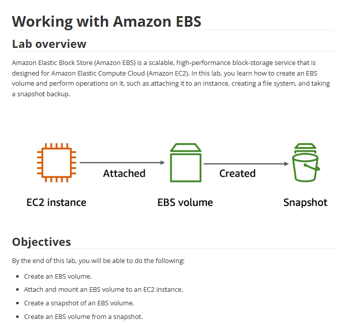

# Lab 11: Trabalhar com o Amazon EBS

Este laboratório é focado no Amazon Elastic Block Store (EBS), o serviço de armazenamento em blocos de alta performance usado pelas instâncias EC2. O lab cobriu todo o ciclo de vida de um volume EBS.

## 🏛️ Fluxo de Trabalho do Laboratório

O processo executado seguiu o ciclo de vida padrão de gerenciamento de um volume EBS: desde a criação, anexação a uma instância, formatação, backup (snapshot) e restauração.

---

## 🎯 Objetivo
Com base nos objetivos do lab, o foco era dominar as seguintes operações:
* Criar um volume EBS novo.
* Anexar (attach) o volume a uma instância EC2.
* Formatar e montar (mount) o volume EBS no sistema operacional da instância.
* Criar um backup pontual do volume (Snapshot).
* Criar um novo volume EBS a partir de um snapshot.

## 🛠️ Tarefas Realizadas

Neste projeto, eu executei o ciclo de vida completo de um volume:

* **1. Criação do Volume:**
    * Criei um novo volume EBS (ex: 8 GiB, gp3) na mesma Zona de Disponibilidade da minha instância EC2.

* **2. Anexação e Formatação:**
    * Anexei o volume à instância EC2 (ex: `/dev/sdf`).
    * Conectei-me à instância (via SSH ou EC2 Instance Connect).
    * Usei comandos do Linux para:
        * Verificar se o disco estava visível (`lsblk`).
        * Formatar o volume com um sistema de arquivos (`mkfs -t xfs /dev/xvdf`).
        * Criar um ponto de montagem (`mkdir /data`).
        * Montar o volume no sistema de arquivos (`mount /dev/xvdf /data`).
    * Adicionei uma entrada no `/etc/fstab` para garantir que o volume fosse montado automaticamente após reinicializações.

* **3. Backup (Snapshot):**
    * Após adicionar dados ao volume, criei um **Snapshot** do EBS.
    * O snapshot serve como um backup incremental, armazenado de forma durável no S3 (de forma gerenciada pela AWS).

* **4. Restauração:**
    * Usei o snapshot criado para "restaurar" e criar um **novo volume EBS** idêntico.
    * Isso demonstrou como os snapshots são usados para recuperação de desastres ou para migrar dados.

## 💡 Conceitos Aprendidos
-   EBS é um "disco de rede" persistente, seu ciclo de vida é independente da instância EC2.
-   Um volume EBS só pode ser anexado a **uma instância EC2 por vez** (na mesma AZ).
-   Volumes novos precisam ser **formatados e montados** pelo sistema operacional (Linux ou Windows) antes de serem usados.
-   **Snapshots** são a base para backup e recuperação de volumes EBS e são incrementais (só salvam os blocos de dados alterados).
-   Como usar `fstab` para garantir a persistência da montagem do disco após um reboot.

## 📸 Minhas Provas (Screenshots)

*(Aqui vou adicionar meus próprios screenshots mostrando o volume sendo criado, os comandos `lsblk` e `mount` no terminal Linux e a lista de Snapshots no console.)*
