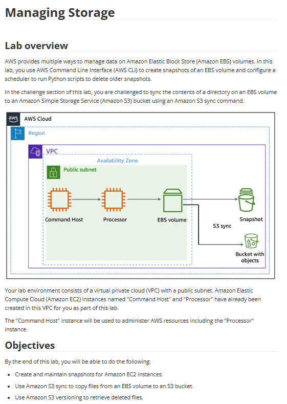

# Lab 12: Gerenciar o armazenamento

Este laboratório foi um desafio focado em diferentes formas de gerenciar dados na AWS, usando a AWS CLI para automatizar o ciclo de vida dos backups, tanto no Amazon EBS quanto no Amazon S3.

## 🏛️ Arquitetura Utilizada

A arquitetura do lab consistia em duas instâncias EC2:
* **Command Host:** Usada como estação de trabalho (bastion) para executar comandos da AWS CLI.
* **Processor:** A instância que continha o volume EBS a ser gerenciado.

O objetivo era usar o "Command Host" para gerenciar os snapshots do "Processor" e sincronizar seus dados com o S3.

---

## 🎯 Objetivo
Com base nos objetivos do lab, o foco era:
* Criar e manter (gerenciar o ciclo de vida) de snapshots de volumes EBS.
* Usar o comando `aws s3 sync` para copiar arquivos de um volume EBS para um bucket S3.
* Habilitar e usar o **Versionamento do S3** para recuperar arquivos excluídos.
* (Desafio) Configurar um agendador para rodar scripts de limpeza de snapshots antigos.

## 🛠️ Tarefas Realizadas

Neste projeto de desafio, eu executei:

* **1. Gerenciamento de Snapshots (EBS):**
    * Usei a AWS CLI (a partir do `Command Host`) para criar snapshots do volume EBS anexado à instância `Processor`.
    * Criei um script (Python) para automatizar a exclusão de snapshots antigos, implementando uma política de retenção.
    * Configurei um agendador (como `cron`) para executar esse script de limpeza periodicamente.

* **2. Backup de Arquivos (S3):**
    * Usei o comando `aws s3 sync` para sincronizar um diretório do volume EBS diretamente para um bucket S3, criando um backup dos arquivos.

* **3. Gerenciamento de Versões (S3):**
    * Habilitei o **Versionamento** no bucket S3.
    * Simulei a exclusão acidental de um arquivo no bucket.
    * Usei os recursos de versionamento do S3 (via console ou CLI) para listar as versões e "restaurar" o arquivo excluído.

## 💡 Conceitos Aprendidos
-   A diferença crucial entre **Snapshots EBS** (backup em nível de bloco, para desastres) e **S3 Sync** (backup em nível de arquivo, para dados).
-   Como automatizar o **Lifecycle Management** de snapshots via script, uma tarefa comum de SysOps/CloudOps.
-   O poder do `aws s3 sync` para backups eficientes (sincroniza apenas arquivos novos ou alterados).
-   A importância do **Versionamento do S3** como uma rede de segurança fundamental contra exclusões acidentais ou ransomware.
-   Uso de uma instância "bastion" (`Command Host`) para gerenciar outros recursos de forma centralizada.

## 📸 Minhas Provas (Screenshots)

*(Aqui vou adicionar meus próprios screenshots mostrando o script de automação, o comando `aws s3 sync` em execução e a tela de recuperação de um arquivo versionado no S3.)*
