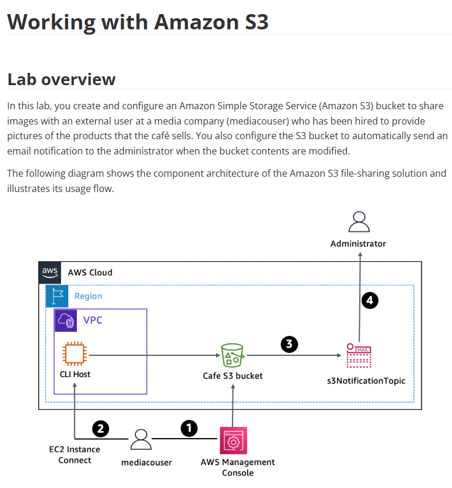

# Lab 14: Trabalhar com o Amazon S3 (Eventos e Notificações)

Este laboratório avançado de S3 foca na automação e integração com outros serviços. O projeto implementa uma solução de "file-sharing" que notifica automaticamente um administrador (via SNS) sempre que novos arquivos são enviados ao bucket.

## 🏛️ Arquitetura Implementada

A arquitetura implementada é orientada a eventos. Um usuário (mediaacouser) faz o upload de arquivos para o S3. O S3 detecta essa mudança e dispara um evento para um Tópico SNS, que por sua vez envia um e-mail para o Administrador.

---

## ⚙️ Fluxo de Trabalho (Workflow)

1.  Um usuário externo (`mediacouser`) faz o upload, alteração ou exclusão de imagens no "Cafe S3 bucket" (via Console AWS).
2.  Como alternativa, o `mediacouser` também pode usar a AWS CLI (a partir do `CLI Host`) para alterar o conteúdo do S3.
3.  O Amazon S3 **detecta uma mudança** (ex: `ObjectCreated`) e publica uma notificação de e-mail no Tópico SNS `s3NotificationTopic`.
4.  O Administrador, que está inscrito no tópico, recebe um e-mail com os detalhes da alteração no bucket.

## 🎯 Objetivo
Com base nos objetivos do lab, o foco era:
* Usar os comandos `s3api` e `s3` da AWS CLI para criar e configurar um bucket S3.
* Verificar e testar as permissões de escrita de um usuário IAM em um bucket.
* Configurar a **Notificação de Eventos** do S3 para disparar um Tópico SNS.

## 🛠️ Tarefas Realizadas

Para construir esta solução de automação, eu:

* **1. Criei e Configurei o Bucket S3:**
    * Usei a AWS CLI (`aws s3 mb`) para criar o `Cafe S3 bucket`.

* **2. Configurei o Usuário IAM:**
    * Criei o usuário `mediacouser` e anexei uma política IAM que concedia permissões de S3 (como `s3:PutObject`, `s3:GetObject`, `s3:DeleteObject`).
    * Testei as permissões fazendo login como o `mediacouser` e tentando fazer upload (o que funcionou) e acessar outros serviços (o que falhou, como esperado).

* **3. Configurei o SNS:**
    * Criei um Tópico SNS (`s3NotificationTopic`).
    * Criei uma "subscription" (inscrição) do tipo E-mail para este tópico e confirmei a inscrição na minha caixa de entrada.

* **4. Configurei a Notificação de Eventos (O Ponto Central):**
    * Naveguei até as propriedades do bucket S3 e configurei as "Notificações de Eventos".
    * Criei um evento para disparar em todas as criações de objeto (`All object create events`).
    * Configurei o "destino" do evento para ser o Tópico SNS criado.
    * (Importante) O S3 automaticamente adicionou a permissão necessária ao Tópico SNS para permitir que o S3 publicasse nele.

* **5. Testei a Solução:**
    * Fiz o upload de um novo arquivo no bucket S3.
    * Em segundos, recebi um e-mail de notificação do SNS, confirmando que o fluxo de automação funcionou de ponta a ponta.

## 💡 Conceitos Aprendidos
-   O poder das **Notificações de Eventos do S3** para iniciar fluxos de trabalho.
-   A integração direta e simples entre **S3 -> SNS** (um padrão de arquitetura muito comum).
-   A diferença entre os comandos da AWS CLI `s3` (alto nível, ex: `sync`) e `s3api` (baixo nível, chamadas diretas da API).
-   Como testar permissões de IAM para validar políticas de segurança.

## 📸 Minhas Provas (Screenshots)

*(Aqui vou adicionar meus próprios screenshots mostrando a configuração da Notificação de Eventos no S3, a política do Tópico SNS e o e-mail de notificação recebido após o upload de um arquivo.)*
