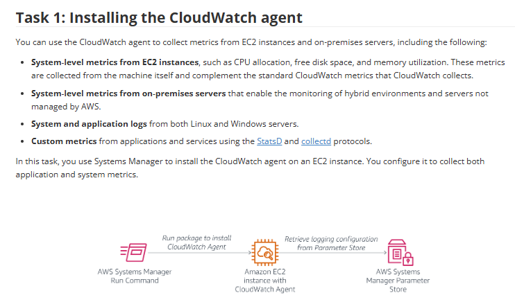
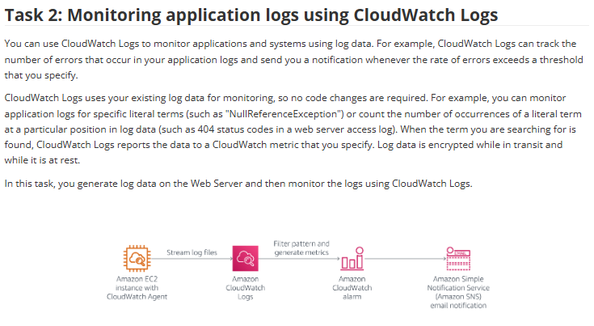
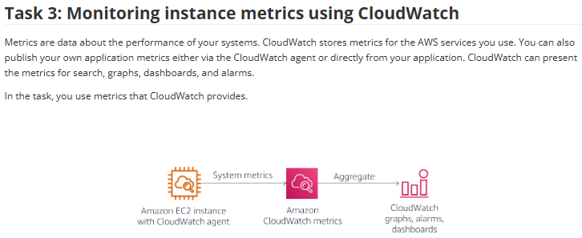
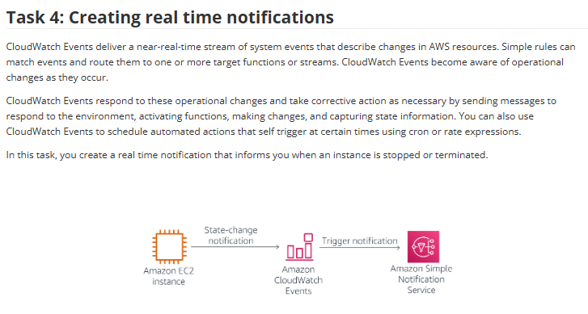

# Lab 21: Monitorar a infraestrutura (CloudWatch)

Este laboratório abrangente foca na implementação de uma solução de monitoramento e observabilidade robusta. A capacidade de monitorar a infraestrutura é crítica para garantir confiabilidade, performance e compliance.

O projeto foi dividido em quatro tarefas principais, cobrindo os pilares do Amazon CloudWatch: **Logs**, **Metrics** e **Events**.

## 🎯 Objetivo
Com base nos objetivos do lab, o foco era implementar uma solução de ponta a ponta para:
* Instalar o **CloudWatch Agent** em instâncias EC2 usando o **SSM Run Command**.
* Monitorar **logs de aplicação** (ex: procurar por erros) usando o **CloudWatch Logs**.
* Monitorar **métricas de sistema** detalhadas (ex: uso de RAM, disco) usando o **CloudWatch Metrics**.
* Criar **notificações em tempo real** para mudanças de estado da infraestrutura (ex: instância parada) usando o **CloudWatch Events** e **SNS**.
* (Bônus) Rastrear a conformidade da infraestrutura usando o **AWS Config**.

---

## 🛠️ Tarefas Realizadas

O laboratório foi estruturado em 4 etapas principais de implementação:

### Task 1: Instalação do CloudWatch Agent via SSM

Para capturar métricas detalhadas (como RAM e espaço em disco) e logs de aplicação, o **CloudWatch Agent** é necessário. A instalação foi automatizada usando o **SSM Run Command**, e a configuração do agente foi buscada de forma segura no **Parameter Store**.

### Task 2: Monitoramento de Logs de Aplicação (CloudWatch Logs)

Com o agente instalado, configurei-o para enviar os logs da aplicação web (ex: `/var/log/httpd/error_log`) para o **CloudWatch Logs**.
* **Ação:** Criei um **Filtro de Métrica** (Metric Filter) para procurar por padrões de erro específicos (ex: "NullPointerException" ou "404").
* **Resultado:** Criei um **Alarme do CloudWatch** que dispara uma notificação **SNS** se o número de erros exceder um limite.

### Task 3: Monitoramento de Métricas do Sistema (CloudWatch Metrics)

Configurei o agente para enviar métricas de sistema personalizadas (que a AWS não coleta por padrão) para o **CloudWatch Metrics**.
* **Métricas Coletadas:** Uso de CPU, **Uso de Memória (%)** e **Espaço em Disco Usado (%)**.
* **Resultado:** Criei dashboards e alarmes baseados nessas métricas detalhadas, permitindo uma visão completa da saúde da instância.

### Task 4: Notificações em Tempo Real (CloudWatch Events)

Para reagir a mudanças operacionais na conta, usei o **CloudWatch Events** (agora Amazon EventBridge).
* **Ação:** Criei uma "Regra de Evento" que escuta por mudanças de estado do EC2 (especificamente "instance-stopped" ou "instance-terminated").
* **Resultado:** Quando o evento ocorre, a regra aciona um **Tópico SNS**, que envia uma notificação imediata por e-mail ao administrador.

---

## 💡 Conceitos Aprendidos
-   **Observabilidade:** Os 3 pilares (Métricas, Logs e Eventos/Traces) e como o CloudWatch os cobre.
-   **CloudWatch Agent:** A ferramenta essencial para obter telemetria profunda (RAM, disco, logs) de dentro do SO.
-   **Automação com SSM:** Como o **Run Command** e o **Parameter Store** trabalham juntos para instalar e configurar software em escala, sem SSH.
-   **Logs to Metrics:** Como usar **Filtros de Métrica** para transformar dados de log (ex: "erro 404") em métricas acionáveis (ex: "número de erros 404 por minuto").
-   **Arquitetura Orientada a Eventos:** Como usar o **CloudWatch Events** para reagir a mudanças na API da AWS (ex: "EC2 parou") em vez de monitorar métricas.

## 📸 Minhas Provas (Screenshots)

*(Aqui vou adicionar meus próprios screenshots mostrando o dashboard do CloudWatch com as métricas de RAM/Disco, o filtro de log encontrando erros e o e-mail de notificação do SNS.)*
