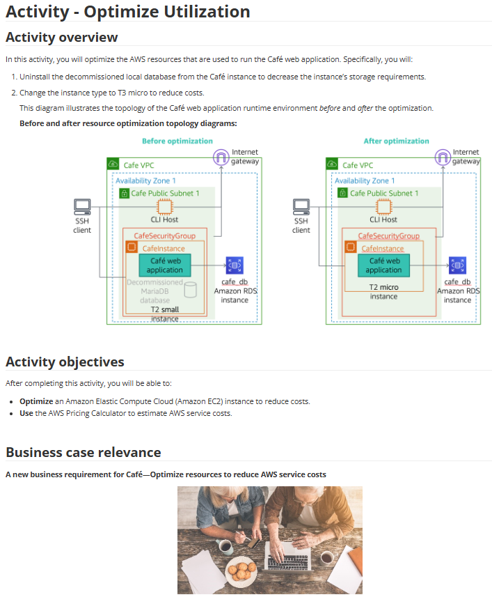

# Lab 26: Otimizar a utilização (Custos) - FinOps

Este laboratório foi focado no pilar de **Otimização de Custos** do AWS Well-Architected Framework, uma prática central de **FinOps**. O cenário consistia em analisar uma aplicação existente (o "Café web application") e aplicar otimizações para reduzir seus custos mensais.

## 🏛️ Arquitetura: Antes e Depois da Otimização

A otimização foi realizada em dois estágios, como mostra o diagrama:

* **Antes:** A instância era uma `T2.small` e ainda continha o banco de dados MariaDB local (agora "Decommissioned"), que foi migrado para o RDS em um lab anterior. A instância estava superdimensionada.
* **Depois:** O banco de dados local foi desinstalado, e a instância foi "redimensionada" (rightsized) para uma `T2.micro`, mais barata e adequada à carga de trabalho.

---

## 🎯 Objetivo
Com base nos objetivos do lab, o foco era puramente **FinOps**:
* **Otimizar (Rightsizing):** Reduzir o tamanho de uma instância EC2 para diminuir os custos.
* **Otimizar (Decommissioning):** Desinstalar softwares desnecessários (o MariaDB local) que consumiam recursos.
* **Análise de Custos:** Usar o **AWS Pricing Calculator** (Calculadora de Preços da AWS) para estimar a economia de custos.

## 🛠️ Tarefas Realizadas

Para reduzir a fatura da AWS deste ambiente, eu executei:

* **1. Descomissionamento de Software (Decommissioning):**
    * Conectei-me à instância `CafeInstance` (via SSH ou Session Manager).
    * Como o banco de dados da aplicação já havia sido migrado para o Amazon RDS, o banco de dados MariaDB local não era mais necessário.
    * Executei os comandos (`sudo yum remove mariadb-server`) para **desinstalar** o software, liberando espaço em disco e recursos de CPU/Memória.

* **2. Redimensionamento da Instância (Rightsizing):**
    * Analisei a carga de trabalho e determinei que, sem o banco de dados local, a instância `T2.small` estava superdimensionada.
    * Parei a instância EC2.
    * Altei o "Tipo de Instância" de `T2.small` para `T2.micro`, que é significativamente mais barato.
    * Iniciei a instância novamente e validei que a aplicação web continuava funcionando normalmente.

* **3. Análise de Economia (Cost Analysis):**
    * Usei o **AWS Pricing Calculator**.
    * Calculei o custo mensal de uma instância `T2.small`.
    * Calculei o custo mensal de uma instância `T2.micro`.
    * Documentei a economia percentual e absoluta ($) obtida com essa simples mudança.

## 💡 Conceitos Aprendidos
-   **FinOps (Cloud Financial Operations):** A prática de gerenciar os custos da nuvem.
-   **Rightsizing (Redimensionamento):** A principal técnica de FinOps. É o processo contínuo de monitorar a performance (usando CloudWatch) e ajustar o tamanho dos recursos (EC2, RDS, etc.) para pagar *exatamente* pelo que se usa, sem desperdício.
-   **Decommissioning (Descomissionamento):** A prática de identificar e remover recursos "zumbis" ou desnecessários (softwares, instâncias, volumes EBS órfãos) que geram custo sem agregar valor.
-   **AWS Pricing Calculator:** A ferramenta oficial para estimar custos de serviços *antes* de implantá-los ou para calcular o impacto de uma mudança.

## 📸 Minhas Provas (Screenshots)

*(Aqui vou adicionar meus próprios screenshots mostrando a instância rodando como T2.micro e, o mais importante, a tela do AWS Pricing Calculator com a comparação de custos lado a lado do "Antes" e "Depois".)*
