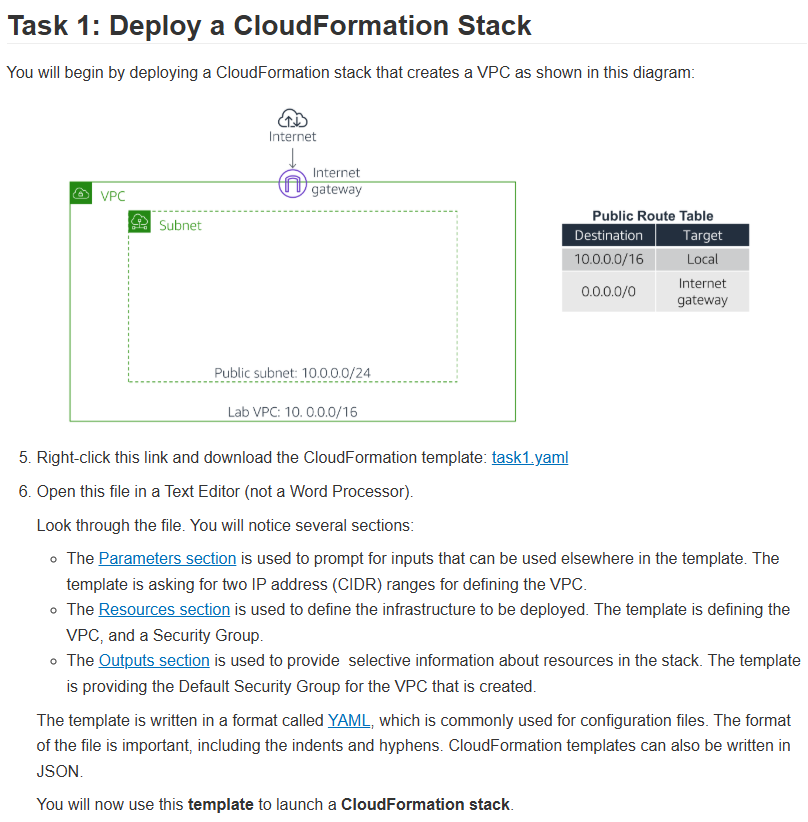

# Lab 23: Automatização com o AWS CloudFormation

Este laboratório foi focado em **Infraestrutura como Código (IaC)**, usando o AWS CloudFormation para definir, implantar e gerenciar a infraestrutura de forma automática e repetível. Em vez de criar recursos manualmente (clicando no console), usamos um arquivo de modelo (`.yaml`) para descrever o estado desejado.

## 🏛️ Arquitetura Inicial (Task 1)

A primeira tarefa foi implantar (fazer o "deploy") de uma "stack" básica que criou a fundação da rede: uma VPC com uma sub-rede pública, um Internet Gateway (IGW) e as Route Tables associadas, tudo a partir de um arquivo `task1.yaml`.

---

## 🎯 Objetivo
Com base nos objetivos do lab, o foco era dominar o ciclo de vida completo de uma "Stack" CloudFormation:
* **Deploy (Create):** Implantar uma stack CloudFormation a partir de um modelo YAML para criar uma VPC e um Security Group.
* **Update:** Configurar (editar) o modelo YAML para adicionar novos recursos (como um S3 bucket e uma instância EC2) a uma stack existente.
* **Consultar Documentação:** Aprender a consultar a documentação oficial do CloudFormation para descobrir como definir recursos (`AWS::S3::Bucket`, `AWS::EC2::Instance`).
* **Terminate (Delete):** Encerrar a stack e garantir que todos os recursos provisionados por ela fossem automaticamente excluídos.

## 🛠️ Tarefas Realizadas

O laboratório foi dividido no ciclo de vida de uma stack:

* **1. Deploy (Create Stack):**
    * Usei o console do CloudFormation para lançar a "stack" inicial (`task1.yaml`).
    * O CloudFormation leu o arquivo e provisionou todos os recursos da seção `Resources` (VPC, Subnet, IGW, Route Table) automaticamente.
    * Verifiquei o status `CREATE_COMPLETE` e os `Outputs` da stack.

* **2. Edição e Atualização (Update Stack):**
    * Este foi o desafio principal. Editei o arquivo `.yaml` localmente para adicionar novos recursos.
    * Aprendi a consultar a documentação da AWS para encontrar a sintaxe correta e as propriedades obrigatórias para:
        * `AWS::S3::Bucket` (para criar um bucket S3).
        * `AWS::EC2::Instance` (para criar uma instância EC2, especificando sua AMI, tipo e a sub-rede criada na Task 1).
    * Usei a função **"Update Stack"** no console, fornecendo o novo arquivo YAML.
    * Analisei o **Change Set** (Conjunto de Mudanças) que o CloudFormation gerou, que mostrou exatamente quais recursos seriam "Adicionados", "Modificados" ou "Removidos" (neste caso, "Add").
    * Executei a atualização, e o CloudFormation provisionou apenas o S3 e o EC2, sem tocar na VPC existente.

* **3. Remoção (Delete Stack):**
    * Ao final, executei a ação **"Delete Stack"**.
    * O CloudFormation cuidou de remover *todos* os recursos que ele criou (EC2, S3, VPC, etc.) na ordem de dependência correta, limpando a conta automaticamente.

## 💡 Conceitos Aprendidos
-   **Infraestrutura como Código (IaC):** A prática de gerenciar infraestrutura em arquivos de texto. Isso torna a infraestrutura **repetível**, **versionável** (pode ir para o Git) e **auditável**.
-   **O que é uma "Stack":** É a unidade de gerenciamento do CloudFormation. É o conjunto de recursos que são criados e gerenciados juntos.
-   **O Ciclo de Vida: Create, Update, Delete.**
-   **Sintaxe do YAML:** A estrutura básica de um template, incluindo `Parameters` (entradas, como CIDRs), `Resources` (o que criar) e `Outputs` (o que exibir, como o ID da VPC).
-   **Change Sets (Conjuntos de Mudanças):** A "prévia" de uma atualização. Esta é a ferramenta de segurança mais importante do CloudFormation, pois evita mudanças acidentais.
-   **Consultar a Documentação:** A habilidade mais importante do lab foi aprender a "se virar sozinho" lendo a documentação oficial para encontrar a sintaxe de novos recursos.

## 📸 Minhas Provas (Screenshots)

*(Aqui vou adicionar meus próprios screenshots mostrando o status `CREATE_COMPLETE` no console, um trecho do código YAML que eu escrevi para o EC2/S3, e o "Change Set" antes de aplicar a atualização.)*
