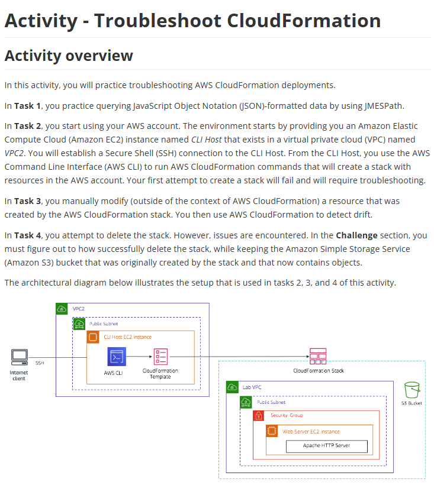

# Lab 24: Solucionar problemas do AWS CloudFormation

Este laboratório avançado foi focado em *troubleshooting* (solução de problemas) de deployments do CloudFormation. Ele simulou os erros mais comuns que ocorrem ao criar, atualizar e excluir "stacks".

## 🏛️ Arquitetura e Cenário do Problema

O cenário envolvia usar uma instância "CLI Host" para executar comandos `aws cloudformation` e implantar uma stack. Esta stack ("Lab VPC") criava uma nova VPC com um servidor web e um bucket S3. O laboratório foi projetado para introduzir erros propositalmente.

---

## 🎯 Objetivo
O objetivo não era construir, mas sim **consertar**. As principais tarefas eram:
* Solucionar um deployment que falhou na criação (Stack Rollback).
* Detectar "drift" (mudanças manuais) em uma stack.
* Solucionar um deployment que falhou na exclusão (Stack Delete Failed).
* Praticar a filtragem de saídas JSON da CLI usando **JMESPath**.

## 🛠️ Processo de Troubleshooting (Tarefas Realizadas)

O lab me forçou a diagnosticar e resolver três problemas clássicos do CloudFormation:

* **1. Falha na Criação (Stack Creation Fails -> `ROLLBACK_COMPLETE`):**
    * **Problema:** Ao tentar criar a stack (`aws cloudformation create-stack`), ela falhou e reverteu para o estado `ROLLBACK_COMPLETE`.
    * **Diagnóstico:** Fui à aba **"Events"** (Eventos) da stack no console do CloudFormation.
    * **Solução:** O log de eventos mostrou um erro claro (ex: "Invalid AMI ID", "Security Group not found"). Corrigi o template `.yaml` (o código) e fiz o deploy novamente com sucesso.

* **2. Detecção de "Drift" (Mudança Manual):**
    * **Problema:** Simulei um cenário onde um colega "mexeu manualmente" em um recurso. Acessei o console do EC2 e alterei o Security Group que o CloudFormation havia criado.
    * **Diagnóstico:** Usei a função **"Detect drift"** na stack do CloudFormation.
    * **Solução:** O CloudFormation corretamente identificou o Security Group como **"MODIFIED"**. Ele mostrou a diferença entre a configuração "Esperada" (no template) e a "Atual" (no console), provando que a stack estava fora de sincronia.

* **3. Falha na Exclusão (Stack Deletion Fails -> `DELETE_FAILED`):**
    * **Problema:** Tentei excluir a stack (`aws cloudformation delete-stack`), mas ela travou no estado `DELETE_FAILED`.
    * **Diagnóstico:** Verifiquei a aba **"Events"** novamente. O erro era claro: "The bucket you tried to delete is not empty" (O bucket S3 não pôde ser excluído pois não estava vazio).
    * **Solução (O Desafio):** O CloudFormation, por padrão, não exclui buckets S3 que contenham objetos. A solução foi navegar até o bucket S3, **esvaziá-lo manualmente** e, em seguida, tentar excluir a stack novamente. Desta vez, funcionou.

## 💡 Conceitos Aprendidos
-   **A aba "Events" é a ferramenta Nº 1:** Para qualquer falha (`ROLLBACK` ou `DELETE_FAILED`), a aba de Eventos diz *exatamente* qual recurso falhou e por quê.
-   **O que é "Drift":** É quando a configuração real (no console) não bate mais com a configuração definida no código (template). A "Detecção de Drift" é a ferramenta para encontrar isso.
-   **Falha na Exclusão de Recursos com "Estado":** O CloudFormation falha de propósito ao tentar excluir recursos que contêm dados (como buckets S3 não vazios ou bancos de dados).
-   **Política de Exclusão (`DeletionPolicy`):** A solução alternativa para a falha de exclusão é definir uma `DeletionPolicy: Retain` no recurso (como o S3). Isso diz ao CloudFormation: "Ao excluir a stack, delete tudo, *menos* este bucket S3. Deixe-o para trás."
-   **JMESPath:** Como usar esta linguagem de consulta para filtrar as saídas JSON da AWS CLI e encontrar rapidamente a informação que eu precisava.

## 📸 Minhas Provas (Screenshots)

*(Aqui vou adicionar meus próprios screenshots mostrando a aba "Events" com um erro de rollback, a tela de "Drift" mostrando um recurso modificado e o erro de "DELETE_FAILED" causado pelo bucket S3.)*
