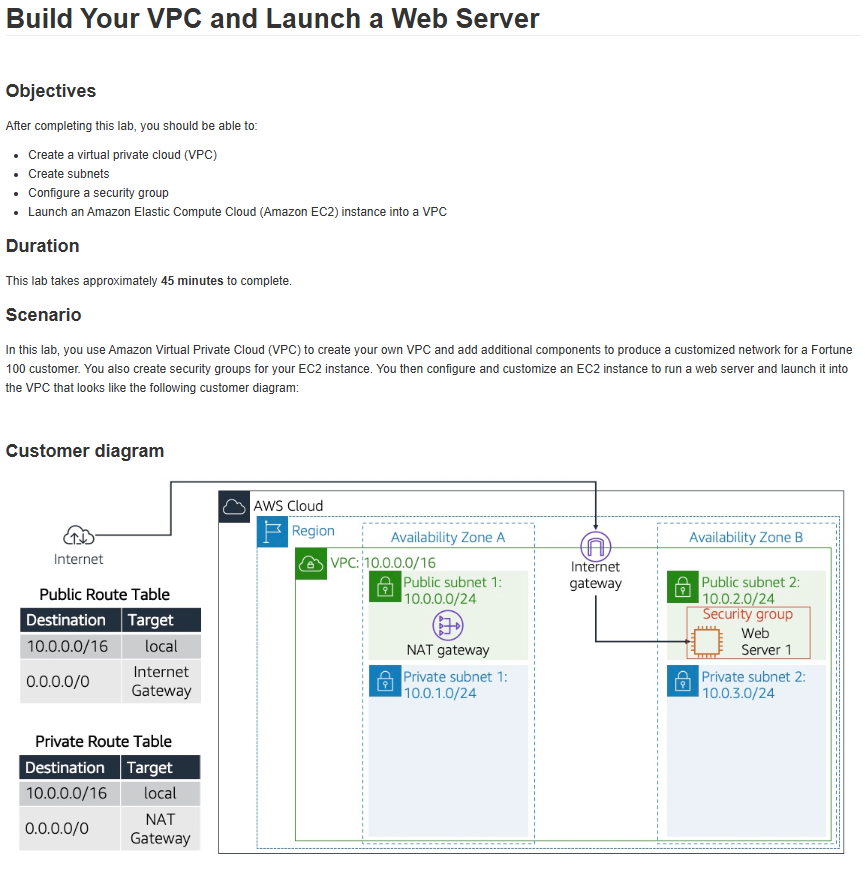

# Lab 03: Criar a sua VPC e iniciar um servidor Web

Este laboratório do AWS re/Start foi um dos mais importantes, combinando conceitos de Rede (VPC) e Computação (EC2).

## 🏛️ Arquitetura Implementada

Abaixo está a arquitetura de rede completa que foi implementada neste laboratório, incluindo uma VPC com sub-redes públicas/privadas, um Internet Gateway e um Servidor Web.

---

## 🎯 Objetivo
O objetivo principal era construir esta Virtual Private Cloud (VPC) customizada a partir do zero e lançar um servidor web dentro dela que fosse acessível pela internet.

## 🛠️ Tarefas Realizadas

Neste projeto, eu configurei os seguintes componentes:

* **1. Criação da VPC:**
    * Criei uma VPC com um bloco CIDR customizado.

* **2. Configuração de Sub-redes:**
    * Criei uma **Sub-rede Pública** e uma **Sub-rede Privada** em Zonas de Disponibilidade diferentes.

* **3. Componentes de Rede:**
    * Criei um **Internet Gateway (IGW)** e o anexei à VPC.
    * Criei uma **Route Table** pública, associando-a à sub-rede pública e adicionando uma rota (`0.0.0.0/0`) para o IGW.

* **4. Lançamento do Servidor Web (EC2):**
    * Lancei uma instância EC2 dentro da **Sub-rede Pública**.
    * Configurei a instância para receber um IP público automaticamente.
    * Utilizei um script de "User Data" para instalar o Apache (`httpd`).

* **5. Configuração de Segurança:**
    * Criei um **Security Group** para o servidor web, liberando a porta 80 (HTTP).

## 💡 Conceitos Aprendidos
- A fundação de qualquer arquitetura AWS começa pela VPC.
- A diferença crucial entre Sub-redes Públicas (com rota para o IGW) e Privadas.
- Como o Security Group atua como um firewall para a instância EC2.

## 📸 Minhas Provas (Screenshots)

*(Aqui vou adicionar meus próprios screenshots do console AWS e do servidor web funcionando para comprovar a execução.)*
