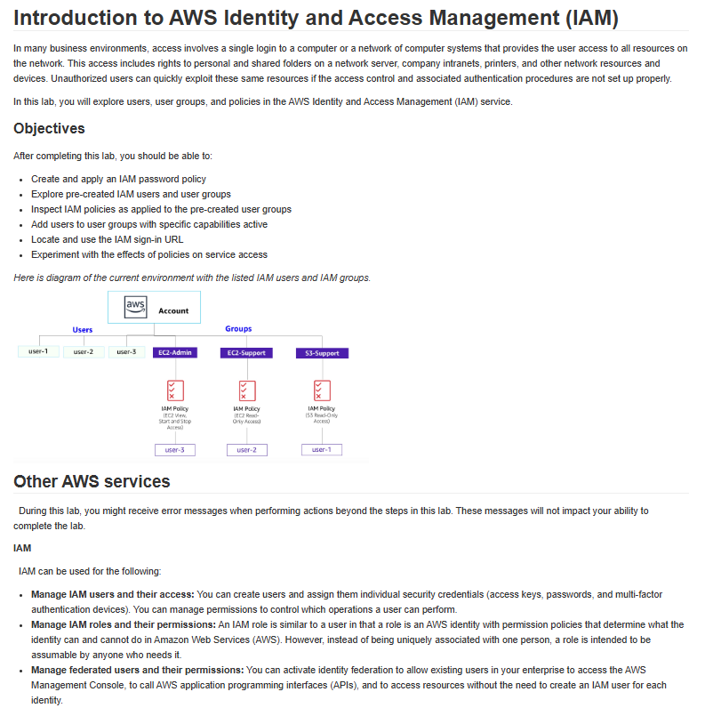

# Lab 01: Introdução ao Gerenciamento de Identidade e Acesso (IAM)

Este é o primeiro laboratório do curso AWS re/Start, dedicado aos fundamentos do AWS Identity and Access Management (IAM). Compreender o IAM é crucial para a segurança na nuvem.

## 🏛️ Cenário e Arquitetura Implementada

O laboratório apresentou um cenário onde era necessário configurar diferentes usuários e grupos com políticas de permissão específicas para acessar recursos da AWS (EC2 e S3).

---

## 🎯 Objetivo
O principal objetivo era entender como o IAM funciona, criando usuários e grupos, e aplicando políticas baseadas em identidade para controlar o acesso a serviços e recursos da AWS de forma granular.

## 🛠️ Tarefas Realizadas

Neste projeto, eu executei as seguintes tarefas:

* **Criação de Usuários:** Criei múltiplos usuários (`user-1`, `user-2`, `user-3`).
* **Criação de Grupos IAM:** Criei grupos para organizar os usuários com base em suas funções (ex: `EC2-Admin`, `S3-Support`).
* **Criação e Anexação de Políticas:**
    * Desenvolvi políticas de IAM customizadas com permissões específicas (ex: "Start and Stop EC2", "S3 Read-Only").
    * Anexei essas políticas aos grupos apropriados, garantindo o princípio do menor privilégio.
* **Testes de Permissão:** Testei as permissões de cada usuário, verificando se eles podiam realizar as ações esperadas (e se eram impedidos de fazer o que não deviam).
* **Uso da URL de Sign-in:** Localizei e usei a URL personalizada de login do IAM.

## 💡 Conceitos Aprendidos
-   A importância do IAM como serviço central de segurança na AWS.
-   A diferença e o uso prático de Usuários, Grupos e Políticas.
-   Como aplicar o princípio do menor privilégio para conceder apenas as permissões necessárias.
-   A gestão de credenciais e o acesso seguro ao Console AWS.

## 📸 Minhas Provas (Screenshots)

*(Aqui vou adicionar meus próprios screenshots do console AWS, mostrando os usuários, grupos e políticas criados, além de prints dos testes de permissão.)*
